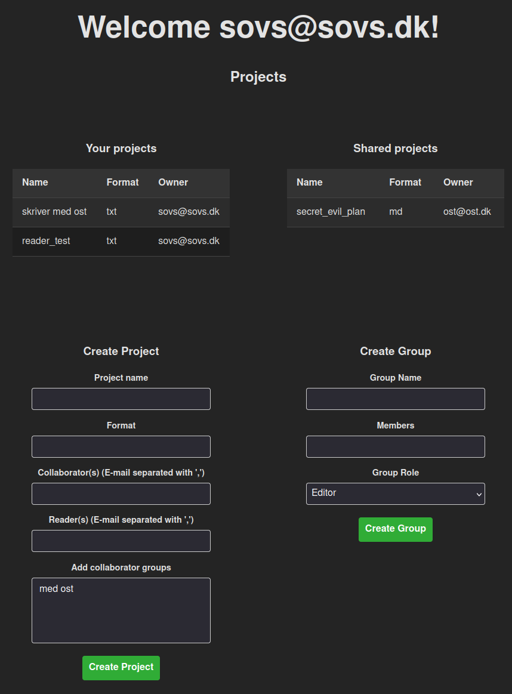
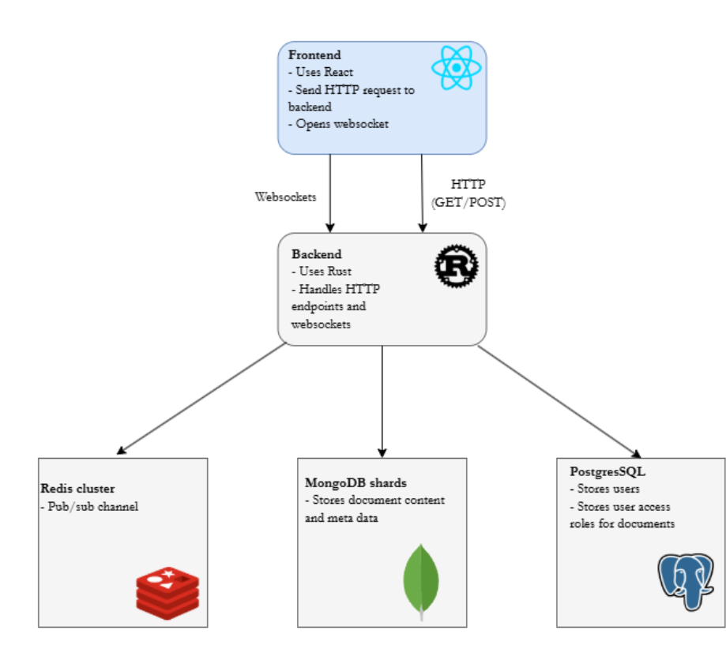

# PDF UNITED
(Or so it could be called)

A proof-of-concept real time collaboration text-editor project created for our course exam in Database Systems.

Features as of now:
- Document Creation
- Collaborator group creation
- Document sharing editor/read-only
- Group document sharing editor/read-only

The project is a simulation of a server-based architecture. It runs 4 docker containers for MongoDB shards, configuration server and router, and 2 containers for a Redis database with a replica. Beware of CPU and memory usage!

### How to setup and run:

#### Prerequisites:

1. An installation of postgreSQL running on localhost with default port configuration.
    Connection string can be modified in `./backend/.env` if for example using another user than `postgres:postgres`

2. `docker` and `docker-compose`

3. `rust` and `cargo` for compiling and managing backend API

4. `npm` for managing and running React frontend.

#### Setup PostgreSQL:

1. Start postgreSQL and create database: `pdfunited`
2. Execute script in db: `./scripts/create_ps_db.sql`
3. insert a user into the `users` table to login with later

#### Setup Redis and MongoDB:

1. run `docker compose -f ./docker/mongodb-cluster/docker-compose.yml`
2. run `docker compose -f ./docker/redis-replica/docker-compose.yml`

This will setup a sharded MongoDB cluster and a replicated Redis instance that is configured as expected in `./backend/.env`

#### Start Client and API applications:

1. navigate to `./backend` 
2. run `cargo run`
3. Open new terminal, navigate to `./frontend`
4. run `npm install`
5. run `npm run dev`
6. In browser, navigate to http://localhost:5173/ and login with created user